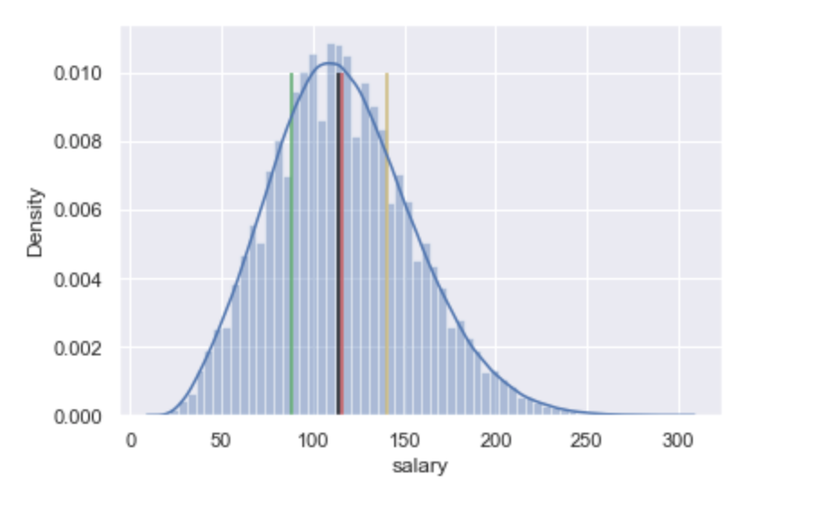

# Salary Prediction Project

**Purpose**
------------------------
On what bases should a job seeker rely to negotiate his salary? What weight should he give to his diploma or his years of experience for such an assessment? What are the salary indicators available to the recruiters of a company in a certain area?
These questions being essential both for the employer - they guarantee him competitiveness - and for the employee - his well-being depends on it, we are trying in this project to provide some answers.

**Datasets**
------------------------
The following data sets were provided:

* **train_features.csv** - This file represents a total of 1,000,000 rows with 8 columns (header not included) where each row examines a unique job id along with list of attributes relating to that unique job id.

* **train_salaries.csv** - This file represent a total of 1,000,000 rows with 2 columns (header not included) where each row represents a unique job id along with its corresponfing salary. This file along with train_features.csv will be used for machine learning models.  

* **test_features.csv** - Identical to train_features.csv, where each row examines a unique job id along with list of attributes relating to that unique job. This file will be used to predict salaries.

**Features**
------------------------
* **jobId** - Job's unique identifier
* **companyId** - Company's unique identifier
* **jobType** - Defines the level of position a such as CEO, CFO CTO, JANITOR, JUNIOR, MANAGER, SENIOR, VP
* **degree** - Describes the level education such as NONE, HIGH SCHOOL, BACHELORS, MASTERS, DOCTORAL diploma
* **major** - Represents a specific level of specialization at a college or university
* **industry** - Characterizes a specific sector or industry such as OIL, FINANCE, EDUCATION, HEALTH, etc
* **yearsExperience** - Specifies the required number of years experience for the indicated/listed job 
* **milesFromMetropolis** - Designates the job distance from a major city in miles

**Data Cleaning**
------------------------
We remove data points with salary equal to $0. We remove also irrelevant features such as `companyId` and `jobId`.

**Data Structure**
------------------------
### Categorical features' barplot

The dataset is balanced regarding almost all features except `major` (more that 50% of the population has no major) and `degree` (`HIGH_SCHOOL` and `NONE` are the modes), but this reflects the reality that [around 50% of the US population attend to college](https://www.census.gov/newsroom/press-releases/2020/educational-attainment.html)

### Numerical features' barplot

The distributions of years experience(`yearsExperience`) and miles form metropolis(`milesFromMetropolis`) are uniform.

### Numerical features vs salary

- There is a possible linear relationship between `salary` and `yearsExperience`
- There is a positive correlation between

### Distribution of salary

The `salary` variable follows a normal distribution

### Variability of salary by `jobType`, `degree`, `major` and `industry`

- Those who have at least bachelors degree earn more in average;
- CTO, CEO and CFO earn more in average;
- The OIL and FINANCE industries have higher average salary;
- Those who have no major tend to have a lower average salary.

**Baseline model**
------------------------

Given that `jobType`feature shows more variability in the salary distribution, we choose a baseline which predicts, for a given data point, the mean salary associated for the job type to which the data point belongs.

**Models selection**
------------------------

The selected models are as follows:
  * Ridge Regression: Basic linear regression model with a regularization hyperparameter.
  * Random Forest: Ensemble learning model which is able to grow many weak decision tree regressor and make prediction by averaging the predicted values from each tree.
  * Gradient Boosting: Ensemble learning model which build decision trees sequentialy such that the nth tree corrects the (n-1)th

The Mean Squared Error is used to check how close our estimates are to the actual values. It is processed by summing up the squared error (actual-predicted) of all the test dataset. A 0 MSE means that the model is perfect.

### MSE

|Models|Mean Squared Error|
|---|---|
|Ridge Regression|383.0554|
|Random Forest|374.0887|
|Gradient Boosting Regressor|355.3878|

### Visualizing the model performance

##### Ridge regression

- The first bisector crosses the scatter
- The model performs well on salary less or egal 100
- The scatter is not centered around the first bisector
- Very High salaries deviate from the first bisector (The model performs bad on very high salaries)

##### Random forest regressor

- The scatter better centered around the first bisector
- The model performs well on salary less or egal 100
- The variance from the first bisector (prediction error) increases while salaries get higher
- The model still underestimate very high salary values

##### Gradient boosting regressor

- The scatter better centered around the first bisector (compared to random forest)
- The model performs well on salary less or egal 100
- The variance from the first bisector is lower (compared to random forest)
- The model performs quit better on very high salary values

**Prediction on the provided test dataset**
------------------------
The best model is Gradient Boosting and it's the one we are going to use when performing prediction on the provided test dataset.
Find below the predicted salaries for the first 5 jobs from the provided test dataset:

|jobId|predicted_salary|
|---|---|
|JOB1362685407687|112.82474|
|JOB1362685407688|90.86375|
|JOB1362685407689|173.21997|
|JOB1362685407690|103.00628|
|JOB1362685407691|117.322495|

**Feature Importance**
------------------------

**Closing Remarks**
------------------------
Our model is now ready and can be used by recruiters to adjust their offers and be competitive. However, we find that the model lacks precision in predicting high wages. This is mainly due to the fact that the learning data contains a large number of job postings for which a university degree is not required, and so the model is more accurate in predicting salaries for such jobs.
Further research may focus on making the model more accurate for high salaries.